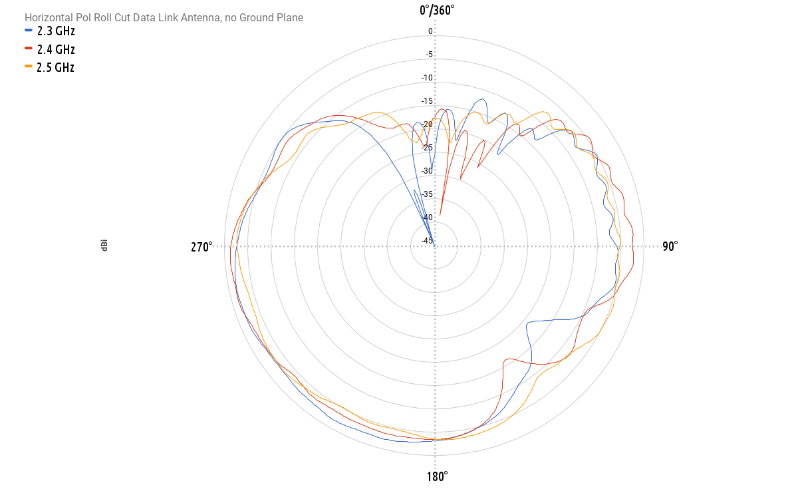
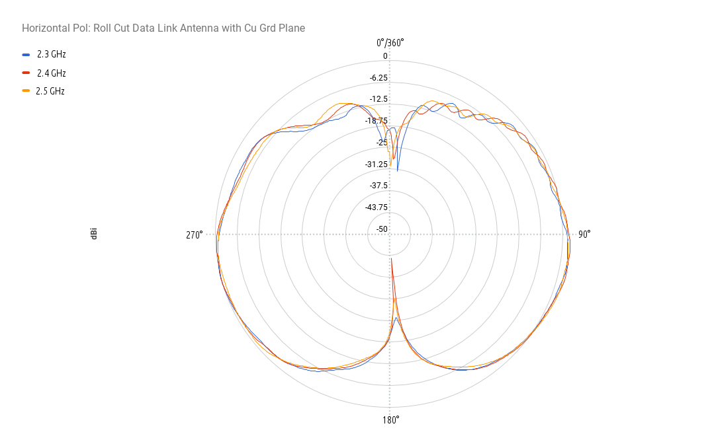
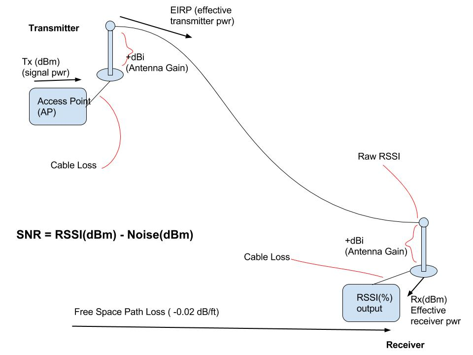
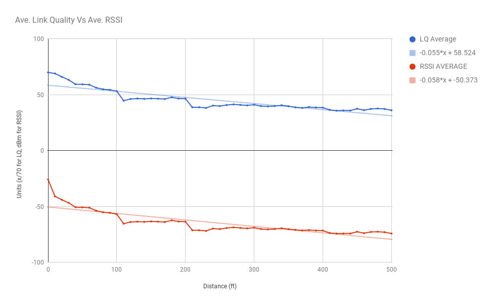
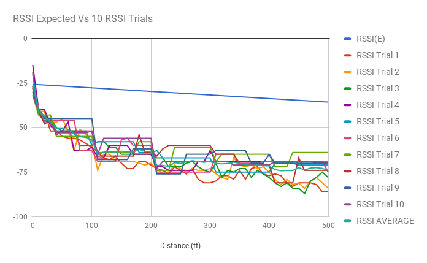
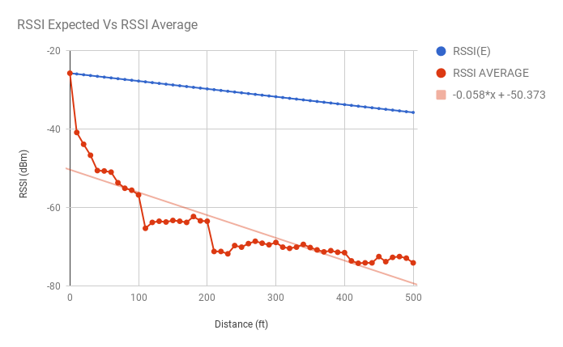

Abby and Henry's  Project: tower-power
====================================

*6/29/17* Project Write-Up
          ----------------

Dr. Horner came in an briefed about a general approach to engineering projects and specifically the scan_eagle project.
 
Project Write-Up <https://docs.google.com/document/d/1eaS7o_meHWN8v9sJA0HZuiy4acDUeysEh0DWbc1Qd-s/edit>

Research
--------

*6/12/17* Dr. Kragelund suggested looking at the following documents as a starting reference for UAV communication.

Powerpoint by D. J. Lee on Wireless Communication
Although his project was a little different, there are still aspects involving UAV radio communications between a ground node.
Note the slides 5-6 with the map, and 12-14 with the calculations and specifics on SNR.
<https://my.nps.edu/documents/106842137/106977447/AIAA+UU+April+07+2009+Final_PDF+Version.pdf/1f66efd0-4a80-4c9c-a781-7c60241ec41d>

Paper by D. J. Lee on Wireless Communication
<https://calhoun.nps.edu/bitstream/handle/10945/52691/Hybrid_Control_of_Long_Endurance.pdf?sequence=1&isAllowed=y>

*6/15/17* Rough Procedure/Research Outline

Scenario 1

*This is a really rough outline of how I think the experiment would be performed as of now. This is mainly to help me organize the topics for my research with questions.*
1. Launch scan eagle
2. Get to an orbit that fits 1 degree/sec ang velocity.
  - How to get scan eagle to flight path, and how to determine angular velocity?
  - Based on scan eagles velocity and ang velocity, somehow calculate dist away (radius) from antenna to orbit from at all times.
3. Complete an orbit at 0 degrees banking angle (flat).
  - Scan eagle will be orbiting in a circle, so its pose will be constantly changing. x, y will change; z (height) will stay constant. Roll and yaw will change, pitch will be constant.
  - Roll = Banking angle!!
4. After every orbit, rotate the scan eagle banking angle 5 degrees or however many degrees towards the antenna.
  - How much can scan eagle roll? What kinds of increments? 5 degrees? 10 degrees?
5. While orbiting, scan eagle is taking readings of the SNR at certain intervals (of time of distance?)
6. After scan eagle finished flying, take the data recorded by scan eagle and create a 3D map of each orbit with unique bank angle.
  - On the 3D map, x axis and y axis are the coordinates and z axis would be the strength(SNR).
  - ros gridmap is able to make 3D maps. *Ill research this more*
  - map will be created with each bank angle
7. Compare the maps to see which bank angle produced the greatest SNR.
8. Repeat this process with a 10 degree/sec orbit.

*6/16/17* Pretty helpful website detailing ros gridmap. How to implement and important methods.
Will come in handy for generating 3D maps

<https://www.researchgate.net/publication/284415855_A_Universal_Grid_Map_Library_Implementation_and_Use_Case_for_Rough_Terrain_Navigation>

*6/23/17* Basic Antenna terminology discussed along with units and formulas.
<http://www.antenna-theory.com/>

Breakdown of Antenna Plots in Cartesian and Polar Format

X axis: Degrees

Y axis: Gain (dBi) dBi is decibels relative to isotropic/omnidirectional antenna. Generally same as dB.

- The colored lines are frequencies in gigahertz (GHz)

- Power Gain: gain(dB) = 10log(POut/PIn) *P is expressed in Watts*

- Voltage Gain: gain(dB) = 10log((VOut^2/ROut)/(VIn^2/ROut))   *Or if the ROuts are equal(which they usu. are)*
__gain(dB) = 20log(VOut/VIn)__

In the case of our antenna plots, gain is negative because ratios between VOut/VIn or POut/PIn are less than 1, which means the signal doesn't vary as much between input and output, so the antenna is a low gain antenna aka omnidirectional.(no signals are concentrated in certain areas like in a dish antenna/high gain)

Signal/Noise

SNR(dBm) = (Pr(dBm))/(Pn(dBm))

P(dBm) = 10log(P(W)/1mW)

Interpolation of Two Data Points to Find the Radius of the Scan Eagle in Relation to Angular Velocity
=====================================================================================================
We were given two data points in order to determine the radius of the Scan Eagle's path at a certain angular velocity (from 1&deg;/sec to 10&deg;/sec).
1&deg;/sec = 2000m
10&deg;/sec = 500m

The linear model would be y = ((-166+(2/3))x)+(2166+(2/3))
This will provide this graph:

*7/3/17* 
Characteristics of Antenna/Antenna Pattern
==========================================

The characteristics of a transmitter and reciever's communication can be modeled here.

SIGNAL(RSSI):
- Measured in dBm from -120dB to 0 dB. (closer to 0 means stronger signal)
- Usual range around -87 to -45 dB
- Affected by Access Point (AP) transmit power, Free space path loss, and reciever antenna.
- RSSI value is pulled from the reciever/client side, therefore not the same as transmitted power from transmitter(EIRP).
- EIRP(Transmitter's effective power) (dBm) = AP's signal power(dBm) + Antenna Gain(dBi)

_RSSI(dB) = (EIRP - 0.2(Dist from Antenna)) + Antenna Gain_

Side topics to understand more:

- IEEE 802.11

NOISE:(needs more research)
- Measured from -120 to 0 dBm (where -120 is the worst noise signal = better RSSI signal)
- Noise is treated like its own signal. 
- Highly fluctuating in the environment/Not constant.
- _Assumed at -95 dBm_
SNR:

_SNR(dB) = Signal Value(dB) - Noise Value(dB)_

It is confusing that SNR is a subtraction problem, but due to the logarithmic nature of decibels, the ratio of SNR is represented as a difference.
Proof under *Decibels*: <https://en.wikipedia.org/wiki/Signal-to-noise_ratio>

*7/5/17*

Viewing SNR
===========

iwconfig: Similar to ifconfig, but is dedicated to wireless interfaces. Used to set network interface parameters, and display them.

_Command to see network parameters: watch -n1 iwconfig_

Program to see Signal, Noise, SNR, Link Quality: Wavemon

Router ESSID: REMUS_NPS

*7/6/17*
Using the router to acquire field test data from NPS Quad as well as Carmel High School
Data displayed in spreadsheets that model signal/noise and link quality as a function of distance.
Plots display how close our theoretical model: _RSSI(dB) = (EIRP - 0.2(Dist from Antenna)) + Antenna Gain_
was to the observed outcome

*7/10/17*

Here is the image for ave. link quality vs ave. RSSI. I've included the trend lines as well as their formulas. I'm not sure the formal way to determine the % similarity, but it is obvious that link quality and RSSI are closely related, according to their best fit slopes and curve shapes.
On another note, I compared the RSSI data to the theoretical model equation we compiled a couple days ago. RSSI = (EIRP - 0.02(Dist from Antenna)) + Antenna gain

For the EIRP, I averaged all ten of the RSSI values at distance = 0  and got -25.8 dBm.
I also disregarded the antenna gain, which I can find later. It would only be a vertical shift and won't fundamentally change the shape of the curve.

RSSI Expected is displayed by the equation: y = -0.02x - 25.8

For the RSSI expected vs RSSI Average graph, I added a trend line, which is modeled by the equation, y = -.058x - 50.373
Again, I compared them using their slopes (I will research a more effective method of comparison), where the expected was  -0.02 and observed was -0.058.
I'm guessing that is not very similar, so the experiment varied quite significantly from the theoretical RSSI model.

*7/11/17*

IEEE 802.11
===========

802.11 is a set of media access control and physical layer specifications for wireless networks in a variety of frequency bands. There are several generations called protocols which hardware and networks are configured under. (802.11a, b, g, n, ac, ad, etc)

Common protocols:

802.11a (ODFM waveform): 5.8 GHz, 1.5 - 54 MBits/s
Hi carrier freq., more absorbance through objects/lower range. Less crowded than common 2.4 GHz

802.11b: 2.4 GHz, max bitrate 11 MBits/s
Low price, interference from other devices like microwaves.

802.11g: 2.4 GHz, max bitrate 54 MBits/s
Backwards compatible with 802.11b.

Continuous Data Collection (7/18/17)
====================================
The biggest problem that needs to be solved for continuous data collection is somehow syncing the link quality and signal data with the distance away from the radio. The goal is to link all of these based on time; however, that will reqiure parsing of each piece of data and then matching the times to the best amount of accuracy.

Currently we have a script that will parse and manipulate the SNMP data to be imported into MATLAB. We need to run more trials of the experiment while actually transferring data on the signal. 
