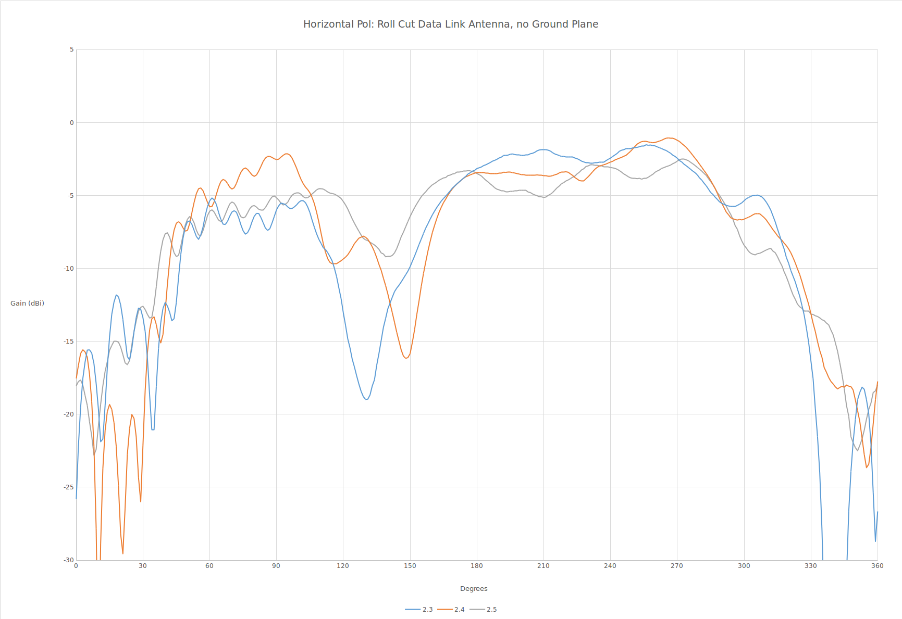
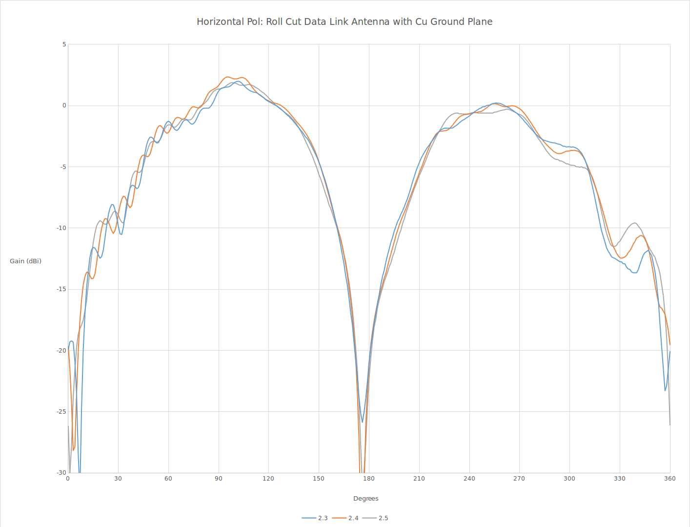
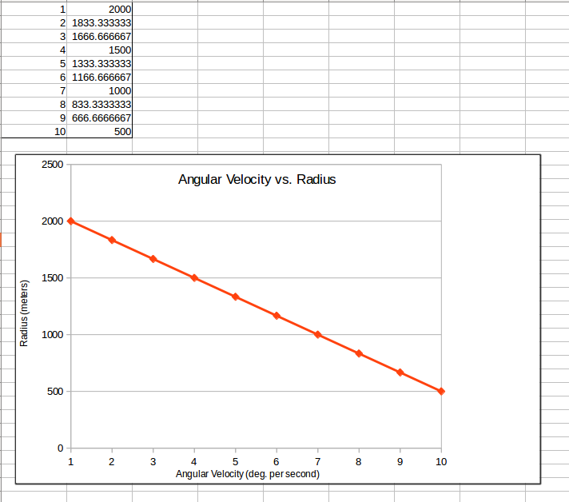

Abby and Henry's  Project: tower-power
====================================

Research
--------

*6/12/17* Dr. Kragelund suggested looking at the following documents as a starting reference for UAV communication.

Powerpoint by D. J. Lee on Wireless Communication
Although his project was a little different, there are still aspects involving UAV radio communications between a ground node.
Note the slides 5-6 with the map, and 12-14 with the calculations and specifics on SNR.
<https://my.nps.edu/documents/106842137/106977447/AIAA+UU+April+07+2009+Final_PDF+Version.pdf/1f66efd0-4a80-4c9c-a781-7c60241ec41d>

Paper by D. J. Lee on Wireless Communication
<https://calhoun.nps.edu/bitstream/handle/10945/52691/Hybrid_Control_of_Long_Endurance.pdf?sequence=1&isAllowed=y>

*6/15/17* Rough Procedure/Research Outline

Scenario 1

*This is a really rough outline of how I think the experiment would be performed as of now. This is mainly to help me organize the topics for my research with questions.*
1. Launch scan eagle
2. Get to an orbit that fits 1 degree/sec ang velocity.
  - How to get scan eagle to flight path, and how to determine angular velocity?
  - Based on scan eagles velocity and ang velocity, somehow calculate dist away (radius) from antenna to orbit from at all times.
3. Complete an orbit at 0 degrees banking angle (flat).
  - Scan eagle will be orbiting in a circle, so its pose will be constantly changing. x, y will change; z (height) will stay constant. Roll and yaw will change, pitch will be constant.
  - Roll = Banking angle!!
4. After every orbit, rotate the scan eagle banking angle 5 degrees or however many degrees towards the antenna.
  - How much can scan eagle roll? What kinds of increments? 5 degrees? 10 degrees?
5. While orbiting, scan eagle is taking readings of the SNR at certain intervals (of time of distance?)
6. After scan eagle finished flying, take the data recorded by scan eagle and create a 3D map of each orbit with unique bank angle.
  - On the 3D map, x axis and y axis are the coordinates and z axis would be the strength(SNR).
  - ros gridmap is able to make 3D maps. *Ill research this more*
  - map will be created with each bank angle
7. Compare the maps to see which bank angle produced the greatest SNR.
8. Repeat this process with a 10 degree/sec orbit.

*6/16/17* Pretty helpful website detailing ros gridmap. How to implement and important methods.
Will come in handy for generating 3D maps

<https://www.researchgate.net/publication/284415855_A_Universal_Grid_Map_Library_Implementation_and_Use_Case_for_Rough_Terrain_Navigation>

*6/23/17* Basic Antenna terminology discussed along with units and formulas.
<http://www.antenna-theory.com/>

Breakdown of Antenna Plots

X axis: Degrees

Y axis: Gain (dBi) dBi is decibels relative to isotropic/omnidirectional antenna. Generally same as dB.

Power Gain: gain(dB) = 10log(POut/PIn) *P is expressed in Watts*

Voltage Gain: gain(dB) = 10log((VOut^2/ROut)/(VIn^2/ROut))   *Or if the ROuts are equal(which they usu. are)*

gain(dB) = 20log(VOut/VIn)

In the case of our antenna plots, gain is negative because ratios between VOut/VIn or POut/PIn are less than 1, which means the signal doesn't vary as much between input and output, so the antenna is a low gain antenna aka omnidirectional.(no signals are concentrated in certain areas like in a dish antenna/high gain)

Signal/Noise

SNR(dBm) = (P_{r(dBm)})/(P_{n(dBm))

P(dBm) = 10log(P(W)/1mW)

Interpolation of Two Data Points to Find the Radius of the Scan Eagle in Relation to Angular Velocity
=====================================================================================================
We were given two data points in order to determine the radius of the Scan Eagle's path at a certain angular velocity (from 1&deg;/sec to 10&deg;/sec).
1&deg;/sec = 2000m
10&deg;/sec = 500m

The linear model would be y = ((-166+(2/3))x)+(2166+(2/3))
This will provide this graph:

